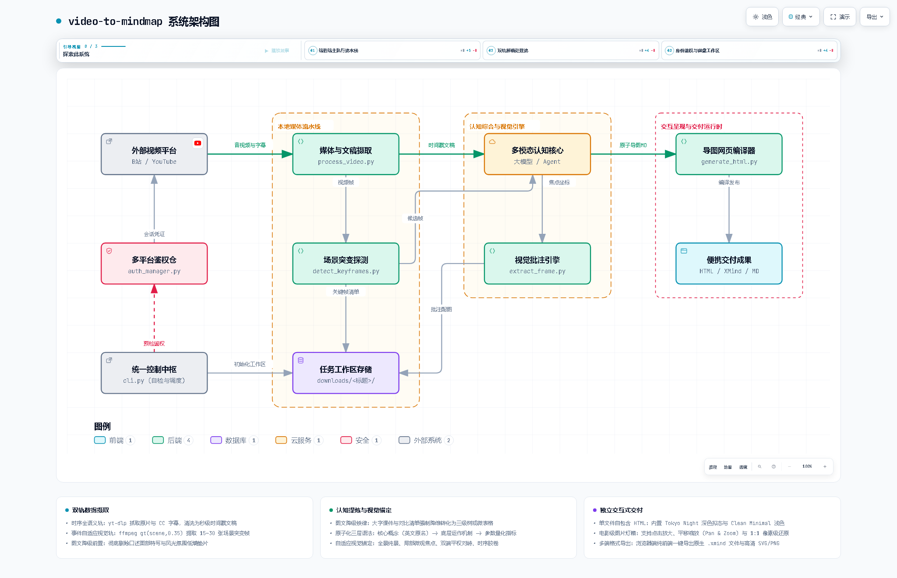
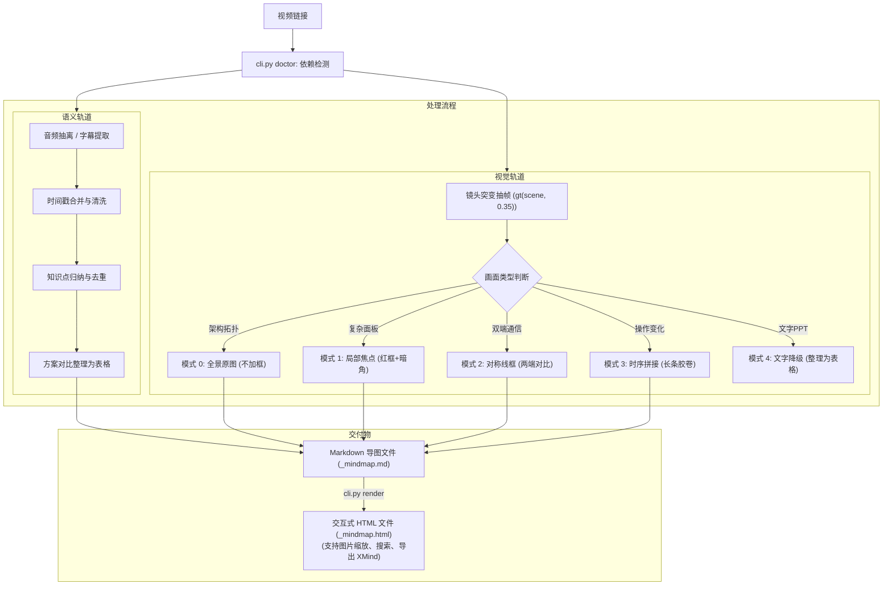

# video-to-mindmap

把长视频与技术讲座提炼成结构清晰的思维导图。支持自动提取画面中的架构图、代码与控制面板并做红框标注，可在浏览器中交互浏览，或直接导出为 XMind 文件。

[](https://www.python.org/)
[](./LICENSE)

[ 简体中文 ](./README.md) • [ English ](./README_EN.md)

---

## 为什么做这个？

长视频课程和技术分享通常信息量很大，但完整看完很花时间。市面上常见的 AI 总结工具往往有两个明显问题：

1. **只读字幕或音频，不看画面**：如果视频里有架构拓扑图、代码演示、板书或参数面板，这些关键视觉信息会被直接漏掉；
2. **输出多为大段流水账**：既没有结构层级，也很难直接导入思维导图软件进行二次整理。

这个工具尝试解决这两个问题：在提取文稿的同时，自动检测视频中的关键画面并进行重点标注（支持红框焦点、步骤序号、局部放大镜、荧光笔高亮与流程箭头等），最后生成可交互的网页版导图，并支持直接导出为标准 `XMind / PNG / SVG / Markdown` 文件。

---

## 功能对比

| 对比项 | 常见文字摘要工具 | video-to-mindmap |
| :--- | :--- | :--- |
| **画面信息** | 仅基于字幕或音频文本，忽略视频画面 | 自动检测画面突变，提取架构图、代码和面板截图 |
| **截图处理** | 容易截取无意义的讲师大头照或大字 PPT | 文字 PPT 自动转为结构化表格，关键拓扑与代码自动进行红框与焦点标注 |
| **文本结构** | 叙述性长段落，缺少参数与技术术语 | 按概念、机制、参数整理成树状层级，公式统一使用 Unicode |
| **输出形式** | 聊天框内的静态 Markdown 文本 | 单文件 HTML 网页，支持分支折叠、搜索和图片放大 |
| **脑图导出** | 需要手动复制排版，导入易格式错乱 | 网页内点击即可直接下载原生 `.xmind` 文件 |
| **运行自检** | 缺少系统依赖（如 ffmpeg）时直接报错退出 | 内置 `python cli.py doctor` 诊断环境并给出对应安装命令 |

---

## 基于信息论的自适应高信息熵呈现模式

为了避免盲目截图导致导图杂乱，工具支持多种画面呈现模式与图元标注：


| 模式 | 适用场景 | 处理方式 | 说明 |
| :--- | :--- | :--- | :--- |
| **模式 0：全景架构 (`pure`)** | 系统拓扑图、网络结构、流程状态机 | 截取完整高清原图 | 保持完整原图更易理解全局上下文 |
| **模式 1：局部焦点 (`focus`)** | 复杂代码、界面参数、局部细节 | 绘制红框并自适应局部聚焦 | 界面元素较多时，引导读者视线快速定位关键内容 |
| **模式 2：双向对比 (`dual`)** | 客户端与服务端交互、两个方案对比 | 使用双色框线分别标出两端 | 便于看清两端交互的时序与对应关系 |
| **模式 3：时序胶卷 (`filmstrip`)** | 多步操作演示、界面前后变化 | 将多个关键帧横向拼接为连续长条，带角标 | 展示操作前后的状态演变过程 |
| **模式 4：文字转表格 (`fallback`)** | 大字 PPT 提纲、纯文字列表、方案清单 | 不截图，直接整理为 Markdown 树与表格 | 文字和表格比图片更容易阅读、复制和搜索 |

### 2. 知识批注扩展图元 (可自由叠加或独立调用)
* **步骤序号 (`--steps`)**：数字序号徽标（`①` `②` `③`）与文字标签，用于标注操作步骤与流程顺序；
* **局部放大镜 (`--zoom`)**：放大画面中的微小细节区域（如局部代码、参数），带瞄准引线；
* **高亮荧光笔 (`--highlight`)**：半透明高亮涂抹，突出重点行或关键配置且不遮挡文字；
* **流程箭头 (`--arrow`)**：带描边的流程箭头，标明数据流向或逻辑跳转；
* **局部遮蔽 (`--blur` / `--pixelate`)**：支持高斯模糊与马赛克，用于敏感信息脱敏。

---

## 核心功能

### 1. 网页版交互导图

#### 🔍 实时搜索与自动定位
支持全文快速检索。匹配深层节点时，会自动展开沿途折叠的父分支，并高亮定位与平滑滚动到目标节点。

<p align="center">
  
</p>

* **① 关键词即时检索**：支持快捷键 `/` 或 `Ctrl+F` 快速唤起输入框，即输即搜；
* **② 匹配计数与跳转**：实时统计命中结果总数，支持 `Enter` / `Shift+Enter` 快速前后遍历；
* **③ 沿途折叠分支自动展开**：即使目标节点深埋于多层折叠分支下，搜索时也会自动穿透展开所有父级节点；
* **④ 匹配节点高亮与居中**：目标节点高亮渲染并自动平滑滚动至视口中央。

#### 🖼️ 图片预览与缩放
导图内置交互式图片查看器（Lightbox）。点击任意图片即可全屏查看，支持鼠标滚轮无级缩放与拖拽平移，方便查验复杂架构与关键机制图谱细节。

<p align="center">
  
</p>

* **① 关键机制图谱高精度呈现**：导图节点直接内嵌视频中的核心拓扑与机制图谱原图，点击直接放大查看；
* **② 全屏无级缩放与平移**：支持鼠标滚轮缩放与鼠标拖拽平移，便于辨析图谱中的微小符号与参数；
* **③ 浮动操作栏**：底部控制条支持 1:1 比例复位、原图一键下载及放大/缩小快捷控制。

#### 🌓 深浅色主题切换
内置 Tokyo Night 深色拟态与 Clean Minimal 极简浅色双套主题，支持快捷键 `T` 一键无缝切换：

<p align="center">
  
</p>

* **① 一键主题切换**：支持快捷键 `T` 或点击顶部浮动控制坞图标快速切换；
* **② Tokyo Night 深色模式**：深色拟态背景，适合弱光夜间环境下的代码审阅与沉浸式阅读；
* **③ Clean Minimal 极简浅色模式（推荐日常）**：高对比纸质视觉，字迹清晰，适合日常学习、文档整理与高亮阅读。

### 2. 多格式导出 (XMind / PNG / SVG / Markdown)
所有导出均在浏览器纯前端完成，无需在本地配置额外的转换工具或服务端环境：

<p align="center">
  
</p>

* **① 控制坞离线导出入口**：集成于顶部浮动控制坞，一键展开离线导出选项；
* **② 原生 .xmind 一键打包**：纯前端基于 JSZip 实时打包生成标准 XMind 文件结构，可直接导入桌面版 XMind 软件二次编辑；
* **③ 多维媒介交付**：支持 4K 超清 PNG 位图、无损矢量 SVG 及结构化 Markdown 大纲文本导出。

### 3. 环境自检工具（`cli.py doctor`）
* 运行 `python cli.py doctor` 可以自动检测 Python 版本、`ffmpeg`、`yt-dlp` 及相关依赖；
* 如果缺少系统组件，会输出对应的安装命令（如 `winget install ...`），方便快速排查配置问题；
* 支持 `--json` 输出，便于自动化脚本或 Agent 调用。

### 4. 单文件便携模式（`--embed-images`）
* 生成 HTML 时加上 `--embed-images` 参数，会将本地截图直接转为 Base64 编码内嵌；
* 生成的单文件 HTML 发给他人时不需要附带图片文件夹，直接双击就能正常显示所有图片。

---

## 快速起步

### 1. 安装依赖

#### 系统依赖（加入 PATH）
| 系统 | 推荐安装命令 |
| :--- | :--- |
| **Windows** | `winget install yt-dlp.yt-dlp Gyan.FFmpeg` （或通过 Scoop: `scoop install yt-dlp ffmpeg`） |
| **macOS** | `brew install yt-dlp ffmpeg` |
| **Linux (Ubuntu/Debian)** | `sudo apt update && sudo apt install ffmpeg` 然后 `pip install -U yt-dlp` |

#### Python 依赖
```bash
git clone https://github.com/WilliamGeek/VTM.git
cd VTM
pip install -r requirements.txt
```

---

### 2. 检查运行环境
在开始前可以运行自检工具，确认外部命令是否正常：
```bash
python cli.py doctor
```
如果各项均显示 `[✓]`，即可开始使用。

---

### 3. 使用流程

#### 步骤 1：抓取视频文稿
```bash
python cli.py fetch "https://www.bilibili.com/video/BVxxxxxx"
```
脚本会分析视频信息，优先提取自带字幕或自动字幕；若无字幕，会自动提取音频轨备用。

#### 步骤 2：提取关键画面
```bash
python cli.py detect "downloads/<视频标题>/<视频名>.mp4" --max-frames 20
```
基于画面场景突变率（`gt(scene, 0.35)`）挑选 15~25 张候选关键帧，避免等频抽帧产生大量重复图片。

#### 步骤 3：截取并标注图片（按需选择模式与高级图元）
```bash
# 基础模式 0：全景架构图（不画框）
python cli.py annotate "视频.mp4" -t "05:12" -o "images/arch.png" --mode pure

# 基础模式 1：局部焦点引导（红框 + 聚光灯暗角）
python cli.py annotate "视频.mp4" -t "12:30" -o "images/focus.png" --mode focus --box "0.2,0.3,0.8,0.7" --label "核心参数" --spotlight

# 基础模式 2：双向对比（分别标出交互两端）
python cli.py annotate "视频.mp4" -t "08:20" -o "images/dual.png" --mode dual --boxes "b1;b2" --labels "客户端;服务端"

# 基础模式 3：时序拼接长条（跨时间戳水平拼接）
python cli.py annotate "视频.mp4" --timestamps "04:15,04:30" -o "images/strip.png" --mode filmstrip --labels "操作前;操作后"

# 高级批注 A：步骤序号徽标 + 文本说明
python cli.py annotate "视频.mp4" -t "06:10" -o "images/steps.png" --steps "0.2,0.3:鉴权;0.5,0.3:路由;0.8,0.3:响应"

# 高级批注 B：局部放大镜（放大细节并带引线）
python cli.py annotate "视频.mp4" -t "14:02" -o "images/zoom.png" --zoom "0.25,0.35,50" --zoom-scale 2.5

# 高级批注 C：荧光笔高亮 + 流程箭头
python cli.py annotate "视频.mp4" -t "18:40" -o "images/flow.png" --highlight "0.1,0.4,0.6,0.45" --arrow "0.3,0.5->0.7,0.5:调用接口"

# 高级批注 D：敏感信息脱敏 (高斯模糊 / 马赛克)
python cli.py annotate "视频.mp4" -t "22:15" -o "images/safe.png" --blur "0.1,0.2,0.4,0.25"
```

#### 步骤 4：编译交互式网页
整理好导图文本 `<视频名>_mindmap.md` 后，运行：
```bash
python cli.py render "downloads/<视频标题>/<视频名>_mindmap.md" --embed-images
```
在浏览器中打开生成的 `.html` 文件即可交互浏览，或在网页中点击导出 `.xmind`。

---

## 快捷键说明

在生成的交互 HTML 页面中，支持以下键盘操作：

| 快捷键 | 功能说明 |
| :--- | :--- |
| **`/` 或 `Ctrl+F`** | 聚焦到搜索框，输入文字实时高亮匹配节点 |
| **`Enter` / `Shift+Enter`** | 跳转到下一个 / 上一个搜索结果 |
| **`1` / `2` / `3`** | 折叠到 1级 / 2级 / 3级 分支 |
| **`0`** | 展开所有分支 |
| **`+` / `-`** | 放大 / 缩小导图视图（或当前灯箱图片） |
| **`Space`** | 导图居中适应窗口 |
| **`T`** | 切换深色与浅色主题 |
| **`F`** | 切换全屏模式 |
| **`Esc`** | 关闭当前放大的图片、清除搜索或关闭弹窗 |
| **`?`** | 打开快捷键帮助窗口 |

---

## 工作流程架构

系统采用双轨解耦流水线（时序语义流 + 高熵视觉流），从**端到端执行流程**与**系统模块拓扑**两个维度建立清晰的技术全貌：

### 1. 端到端执行流水线 (Execution Pipeline)

展示长视频从输入接入、前置自检、双轨解耦并行提取，到单文件编译封装与客户端交互导图的完整执行生命周期：

<p align="center">
  
</p>

#### 四层流转机制解析

* **① 输入接入与自检层 (`Ingest & Diagnostics`)**：接收视频 URL 或本地 MP4；`cli.py doctor` 前置自检 `ffmpeg` 与 `yt-dlp` 就绪状态，若有缺失输出精确修复命令并阻断，保障流水线鲁棒性；
* **② 双轨解耦并行特征提取 (`Dual-Track Pipeline`)**：
  * **语义时序流**：`cli.py fetch` 抽取字幕或音频轨，对齐时间戳并进行语义去重，将口述长文本沉淀为层级概念、机制说明与 Markdown 规范对比表格；
  * **视觉高熵流**：`cli.py detect` 基于场景突变算法（`scene > 0.35`）过滤冗余讲师镜头，定位拓扑/代码/面板，并通过 `cli.py annotate` 施加 5 大模式与红框焦点、序号、放大镜或高亮批注；
* **③ 单文件编译封装层 (`Compiler & Packaging`)**：`cli.py render` 解析 Markdown 语法树与关联图谱，通过 `--embed-images` 将图片转为 Base64 编码，与 Markmap 渲染引擎捆绑生成零外部依赖的独立 `.html`；
* **④ 视窗交互与离线交付层 (`Compiler & Delivery`)**：支持多层级折叠展开、快捷键穿透检索与视口居中、原图无级缩放灯箱及双主题秒切；纯前端基于 JSZip 打包原生 `.xmind`、4K PNG 与矢量 SVG，无需服务端参与。

---

### 2. 系统模块与存储拓扑 (System Topology & Boundaries)

展示系统的核心组件职责、凭据鉴权仓、多模态认知核心与本地磁盘工作区的持久化组织关系：

<p align="center">
  
</p>

#### 核心子系统与边界职责

* **统一控制中枢 (`cli.py`)**：负责统一命令调度、环境自检与工作区任务初始化，驱动上下游子模块协作；
* **多平台鉴权仓 (`auth_manager.py`)**：管理 B站 / YouTube 等平台的会话凭据与扫码登录，向下载摄取流注入安全 Cookie；
* **本地媒体流水线 (`process_video.py` / `detect_keyframes.py`)**：负责音视频流解复用、智能镜头突变抽帧与候选关键帧清单生成；
* **任务工作区存储 (`downloads/<标题>/`)**：统一收纳单次任务的原始媒体流、字幕草稿、候选帧清单与最终标注图片，提供可复现的持久化上下文；
* **认知综合与视觉引擎 (`LLM / Agent` + `extract_frame.py`)**：大模型/Agent 驱动语义分层、表格降级与坐标决策，视觉批注引擎落实红框焦点与图元绘制；
* **交付运行时 (`generate_html.py`)**：将结构化导图与多模态资产编译打包为单文件 HTML，并支撑原生 `.xmind` 客户端格式打包导出。

<details>
<summary><b>查看原始 Mermaid 节点拓扑图</b></summary>


</details>

---

## Agent 集成

本项目包含标准 `SKILL.md`，可作为技能挂载到 AI 编程助手或智能体中（如 Antigravity、Claude Code、Cursor 等）。

在对话中告知 Agent 视频链接，Agent 可先通过 `python cli.py doctor --json` 检查本地工具是否就绪，随后调用脚本完成抓取、标注与导图编译。

---

## 开源协议

本项目基于 MIT 协议开源。
