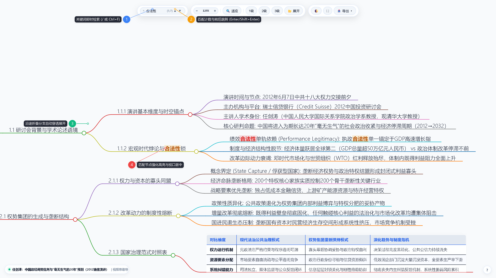
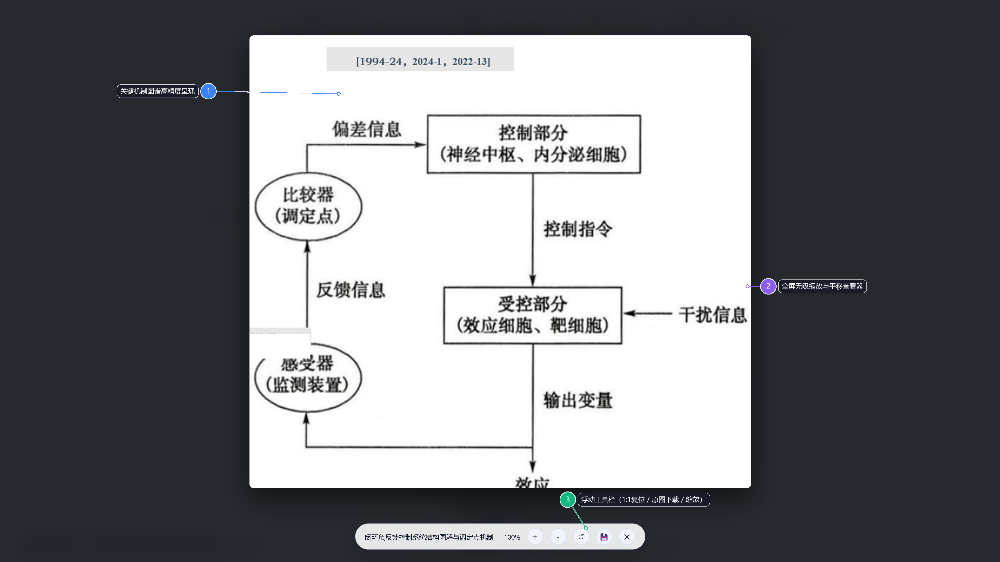
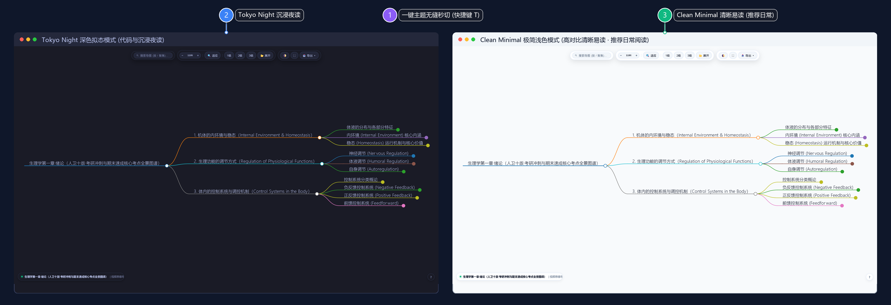
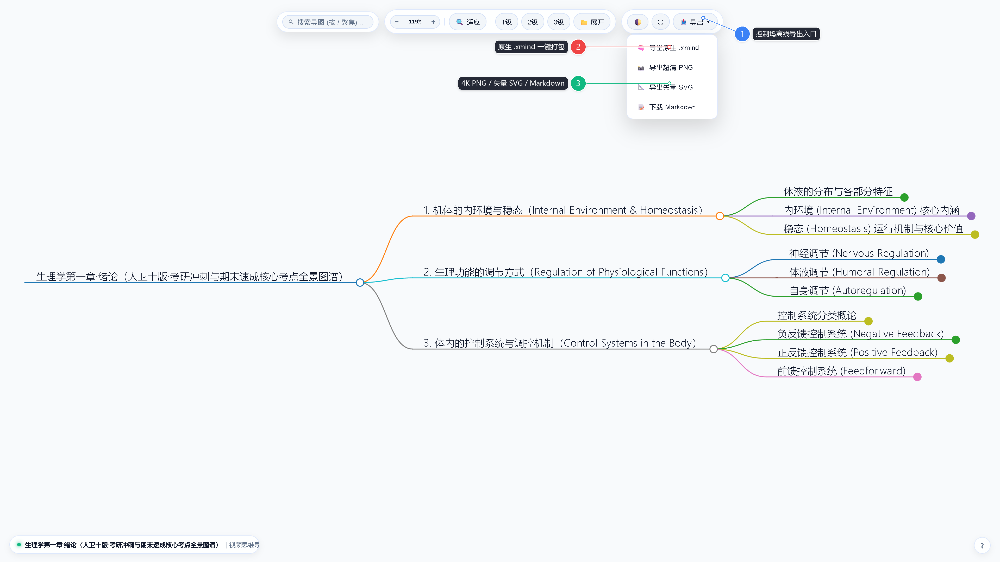
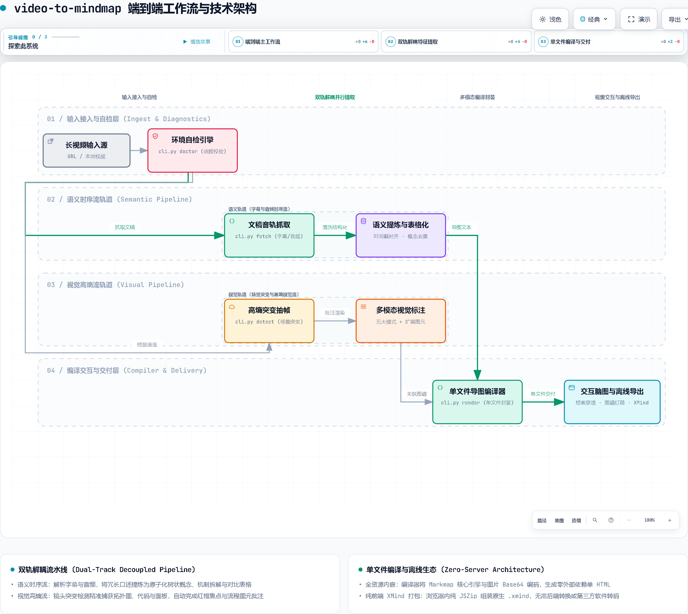
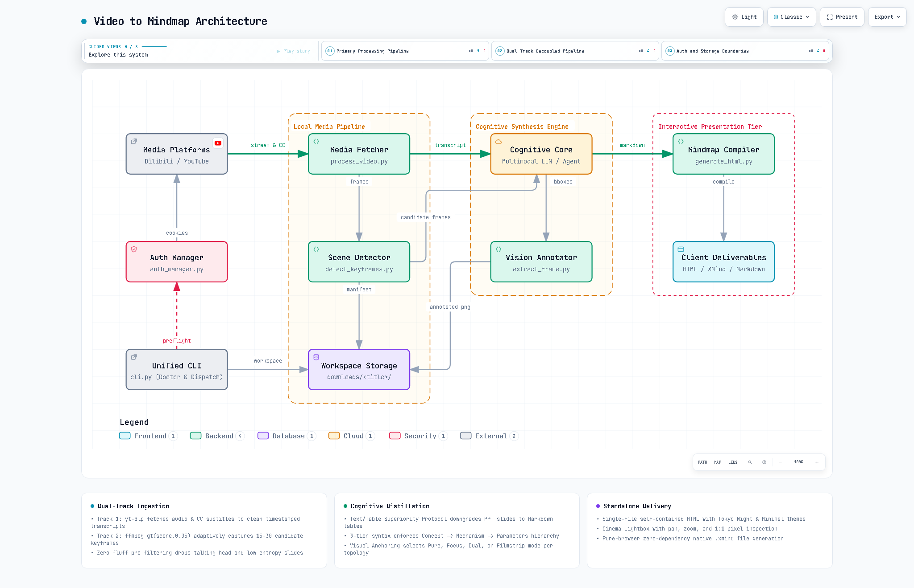
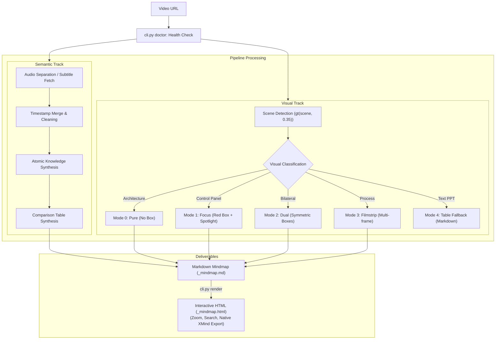

# video-to-mindmap

Turn long-form videos and technical lectures into clear, well-structured mindmaps. Automatically extracts topologies, code, and control panels with focused annotations, browsable interactively in your browser, and exportable to native XMind files.

[](https://www.python.org/)
[](./LICENSE)

[ 简体中文 ](./README.md) • [ English ](./README_EN.md)

---

## Why Build This?

Long-form video lectures and technical talks carry dense knowledge, but watching them end-to-end is time-consuming. Conventional AI summary tools typically suffer from two core shortcomings:

1. **Audio/Subtitle-Only, Screen-Blind**: If a video contains architectural topologies, code walkthroughs, whiteboards, or parameter dashboards, these crucial visual insights are completely missed;
2. **Monolithic Wall of Text**: Outputs are usually flat narrative paragraphs without hierarchy, making them tedious to digest and painful to import into mindmap software for reorganization.

`video-to-mindmap` tackles both bottlenecks: while parsing transcripts, it automatically detects scene transitions to capture high-value visuals with key annotations (red focus boxes, step badges, picture-in-picture magnifiers, highlighters, and flow arrows). It compiles everything into an interactive single-file HTML mindmap and supports 1-click export to native `.xmind` files.

---

## Feature Comparison

| Feature | Typical Text Summarizers | video-to-mindmap |
| :--- | :--- | :--- |
| **Visual Info** | Uses only subtitles or audio; ignores the screen | Detects scene transitions to extract topologies, code, and UI panels |
| **Visual Quality** | Often captures redundant talking heads or text slides | Converts text slides to tables; applies focused bounding boxes and annotations |
| **Structure** | Flat narrative paragraphs without technical depth | Hierarchical tree organized by concept, mechanism, and formulas (Unicode) |
| **Output Format** | Static text block in a chat box | Single-file HTML with branch folding, full-text search, and image zoom |
| **Mindmap Export** | Requires manual copying and reformatting | 1-click in-browser export to native `.xmind` files |
| **Environment Check** | Fails with obscure errors if system tools are missing | Built-in `python cli.py doctor` checks tools and prints installation commands |

---

## Adaptive High-Entropy Visual Presentation Modes

To keep mindmaps structured and readable, the tool supports several presentation modes and annotation primitives:

| Mode | Scenario | Handling | Notes |
| :--- | :--- | :--- | :--- |
| **Mode 0: Panorama (`pure`)** | System architectures, network layouts, state machines | Clean high-res screenshot | Keeps the full layout intact to preserve overall context |
| **Mode 1: Focus (`focus`)** | Code snippets, parameter rows, UI details | Draws a red box with adaptive localized focus | Directs the viewer's attention to specific key areas |
| **Mode 2: Dual (`dual`)** | Client-Server interactions, comparative options | Dual-colored boxes marking both ends | Clarifies bilateral communication and relationships |
| **Mode 3: Filmstrip (`filmstrip`)** | Multi-step workflows, UI state transitions | Horizontal filmstrip stitching multiple keyframes | Displays step-by-step transformations with badges |
| **Mode 4: Table Fallback (`fallback`)** | Text outline slides, bullet lists, feature checklists | No screenshot; converted to a Markdown table | Text tables are easier to read, copy, and search |

### 2. Advanced Annotation Primitives (Composable)
* **Step Pins (`--steps`)**: Numbered badges (`①` `②` `③`) with text labels, indicating sequential steps;
* **Magnifier Loupe (`--zoom`)**: Zooms in on dense details (code, parameters) with guide lines;
* **Highlighter (`--highlight`)**: Translucent highlight over text or configs without obscuring glyphs;
* **Directional Arrows (`--arrow`)**: Outlined flow arrows showing data or logical transitions;
* **Privacy Redaction (`--blur` / `--pixelate`)**: Gaussian blur or pixelation grid for redacting sensitive credentials.

---

## Core Features

### 1. Interactive Web Mindmap

#### 🔍 Instant Search & Auto-Locate
Features fast full-text search. When matching deep nodes, the viewer automatically unfolds collapsed parent branches, highlights matches, and smoothly scrolls to center the view.

<p align="center">
  
</p>

* **① Instant Keyword Search**: Press `/` or `Ctrl+F` to open the search bar with instant query matching;
* **② Match Counter & Traversal**: Displays total matches with current index, supporting `Enter` / `Shift+Enter` cycling;
* **③ Auto-Unfold Collapsed Branches**: Traverses and expands all hidden ancestor branches when a deeply nested node matches;
* **④ Highlight & Auto-Center**: Accentuates the matched node and smoothly scrolls the viewport to center it.

#### 🖼️ Image Lightbox & Zoom
Built-in interactive image modal viewer (Lightbox). Click any diagram to view full-size, with mouse wheel zoom and drag-to-pan to inspect complex architectures and technical details.

<p align="center">
  
</p>

* **① High-Fidelity Embedded Visuals**: Nodes embed video keyframes and mechanism diagrams directly; clicking instantly triggers the lightbox;
* **② Stepless Zoom & Pan**: Use the mouse wheel to zoom in/out and drag to inspect fine text, parameters, and circuit symbols;
* **③ Floating Utility Bar**: Bottom bar provides 1:1 scale reset, one-click raw image download, and zoom controls.

#### 🌓 Dual Color Themes
Equipped with Tokyo Night (Dark) and Clean Minimal (Light) themes, switchable instantly via keyboard shortcut `T`:

<p align="center">
  
</p>

* **① Instant Theme Switching**: Toggle themes seamlessly using shortcut `T` or the dock toggle icon;
* **② Tokyo Night Dark Theme**: Skeuomorphic dark palette designed for low-light code reviews and immersive evening study;
* **③ Clean Minimal Light Theme (Recommended)**: High-contrast paper aesthetic with crisp typography, ideal for daytime reading and documentation.

### 2. Multi-Format Export (XMind / PNG / SVG / Markdown)
All exports execute entirely client-side in the browser without local converter tools or server runtimes:

<p align="center">
  
</p>

* **① Dock Offline Export Portal**: Integrated directly into the top floating dock to open offline export options;
* **② Native .xmind Packaging**: Generates valid XMind archive packages entirely client-side via JSZip, ready for desktop XMind re-editing;
* **③ Multi-Format Deliverables**: Supports 4K high-res PNG bitmap captures, lossless vector SVG, and clean structured Markdown outlines.

### 3. Environment Diagnostics (`cli.py doctor`)
* Run `python cli.py doctor` to verify Python version, `ffmpeg`, `yt-dlp`, and required dependencies;
* If a component is missing, it provides copy-paste installation commands;
* Supports `--json` output for automated scripts and AI Agent workflows.

### 4. Standalone File Mode (`--embed-images`)
* Adding `--embed-images` during compilation converts local images into Base64 data URLs;
* Generates a single self-contained `.html` file that can be shared via email or messaging apps without a companion image folder.

---

## Quickstart

### 1. Install Dependencies

#### System Tools (Add to PATH)
| OS | Recommended Command |
| :--- | :--- |
| **Windows** | `winget install yt-dlp.yt-dlp Gyan.FFmpeg` (or Scoop: `scoop install yt-dlp ffmpeg`) |
| **macOS** | `brew install yt-dlp ffmpeg` |
| **Linux (Ubuntu/Debian)** | `sudo apt update && sudo apt install ffmpeg` then `pip install -U yt-dlp` |

#### Python Libraries
```bash
git clone https://github.com/WilliamGeek/VTM.git
cd VTM
pip install -r requirements.txt
```

---

### 2. Check Environment
Before starting, run the diagnostic check to ensure all dependencies are properly installed:
```bash
python cli.py doctor
```
If all items show `[✓]`, you're ready to go.

---

### 3. Workflow

#### Step 1: Fetch Video Transcript
```bash
python cli.py fetch "https://www.bilibili.com/video/BVxxxxxx"
```
Fetches video metadata and prioritizes native or auto-generated subtitles. If unavailable, extracts the audio track for downstream speech processing.

#### Step 2: Detect Key Visual Scenes
```bash
python cli.py detect "downloads/<Video Title>/<Video Name>.mp4" --max-frames 20
```
Detects scene transitions (`gt(scene, 0.35)`) to pick 15~25 candidate frames, avoiding redundant captures from fixed-interval sampling.

#### Step 3: Annotate Images (Choose Mode & Primitives)
```bash
# Base Mode 0: Architectural Panorama (no box)
python cli.py annotate "video.mp4" -t "05:12" -o "images/arch.png" --mode pure

# Base Mode 1: Local Focus (red box + spotlight vignette)
python cli.py annotate "video.mp4" -t "12:30" -o "images/focus.png" --mode focus --box "0.2,0.3,0.8,0.7" --label "Core Parameter" --spotlight

# Base Mode 2: Symmetrical Dual Comparison (Both Ends)
python cli.py annotate "video.mp4" -t "08:20" -o "images/dual.png" --mode dual --boxes "b1;b2" --labels "Client;Server"

# Base Mode 3: Chronological Filmstrip
python cli.py annotate "video.mp4" --timestamps "04:15,04:30" -o "images/strip.png" --mode filmstrip --labels "Before;After"

# Advanced A: Step Badges + Labels
python cli.py annotate "video.mp4" -t "06:10" -o "images/steps.png" --steps "0.2,0.3:Auth;0.5,0.3:Route;0.8,0.3:Response"

# Advanced B: Magnifier Loupe + Guide Line
python cli.py annotate "video.mp4" -t "14:02" -o "images/zoom.png" --zoom "0.25,0.35,50" --zoom-scale 2.5

# Advanced C: Highlighter + Flow Arrows
python cli.py annotate "video.mp4" -t "18:40" -o "images/flow.png" --highlight "0.1,0.4,0.6,0.45" --arrow "0.3,0.5->0.7,0.5:Call API"

# Advanced D: Privacy Redaction (Gaussian Blur / Pixelation)
python cli.py annotate "video.mp4" -t "22:15" -o "images/safe.png" --blur "0.1,0.2,0.4,0.25"
```

#### Step 4: Compile Interactive Mindmap
Once `<Video Name>_mindmap.md` is formatted:
```bash
python cli.py render "downloads/<Video Title>/<Video Name>_mindmap.md" --embed-images
```
Open the generated `.html` in any browser to inspect interactively or export `.xmind`.

---

## Keyboard Shortcuts

The interactive HTML mindmap supports the following hotkeys:

| Shortcut | Description |
| :--- | :--- |
| **`/` or `Ctrl+F`** | Focus search bar; query matches highlight in real-time |
| **`Enter` / `Shift+Enter`** | Jump to next / previous search match |
| **`1` / `2` / `3`** | Collapse tree to Depth 1, 2, or 3 |
| **`0`** | Expand all branches |
| **`+` / `-`** | Zoom in / out canvas view (or current lightbox image) |
| **`Space`** | Fit and center canvas to screen |
| **`T`** | Toggle Dark and Light themes |
| **`F`** | Toggle fullscreen mode |
| **`Esc`** | Close lightbox modal, clear search, or dismiss popups |
| **`?`** | Open shortcut cheat sheet |

---

## Workflow & System Architecture

The system adopts a dual-track decoupled pipeline (Temporal Semantic Stream + High-Entropy Visual Stream), establishing technical clarity across two core dimensions: **End-to-End Execution Flow** and **System Component Topology**:

### 1. End-to-End Execution Pipeline

Illustrates the complete lifecycle of processing long-form technical videos—from ingestion, pre-flight diagnostics, dual-track parallel extraction, to single-file compilation and client-side interactive delivery:

<p align="center">
  
</p>

#### Four-Tier Execution Flow Breakdown

* **① Ingestion & Diagnostics Tier (`Ingest & Diagnostics`)**: Ingests online video URLs (Bilibili / YouTube) or local MP4 files; `cli.py doctor` performs pre-flight checks on `ffmpeg` and `yt-dlp` availability, outputting platform-specific install commands upon failure to ensure robust execution;
* **② Dual-Track Decoupled Feature Extraction (`Dual-Track Pipeline`)**:
  * **Temporal Semantic Stream**: `cli.py fetch` extracts subtitles or audio tracks, synchronizes timestamp windows, and deduplicates spoken dialogue into hierarchical concepts, mechanism explanations, and standard Markdown comparison tables;
  * **High-Entropy Visual Stream**: `cli.py detect` leverages scene-change detection (`scene > 0.35`) to filter out talking-head footage, pinpointing system topologies, code snippets, and UI panels; `cli.py annotate` then applies 5 presentation modes alongside focus boxes, step badges, magnifiers, and flow arrows;
* **③ Standalone Compiler & Packaging Tier (`Compiler & Packaging`)**: `cli.py render` parses Markdown syntax trees and associated diagram graphs, embedding local image assets as Base64 data URLs via `--embed-images` and bundling with Markmap runtime assets into a standalone, zero-dependency `.html` file;
* **④ Viewport Interactivity & Offline Delivery Tier (`Compiler & Delivery`)**: Provides multi-level branch folding, shortcut-driven deep search with automatic branch expansion and viewport centering, stepless zoomable lightboxes, and instant dual-theme switching; client-side JSZip packaging exports native `.xmind`, 4K PNG, and vector SVG files without any server-side dependencies.

---

### 2. System Topology & Storage Boundaries

Illustrates the responsibilities of core subsystems, authentication credentials vault, multimodal cognitive reasoning core, and the persistent local workspace hierarchy:

<p align="center">
  
</p>

#### Core Subsystems & Boundary Responsibilities

* **Unified CLI Orchestrator (`cli.py`)**: Acts as the single entry point for command dispatching, environment diagnostics, and workspace lifecycle management, coordinating upstream and downstream modules;
* **Multi-Platform Auth Vault (`auth_manager.py`)**: Manages session credentials and QR code authentication across platforms (Bilibili / YouTube), injecting secure cookies into video fetch streams;
* **Local Media Pipeline (`process_video.py` / `detect_keyframes.py`)**: Handles audio/video stream demuxing, intelligent scene-cut keyframe detection, and candidate frame manifest generation;
* **Task Workspace Storage (`downloads/<title>/`)**: Stores raw media streams, subtitle transcripts, candidate frame lists, and final annotated images for each task, ensuring reproducible persistence;
* **Cognitive Reasoning & Visual Engine (`LLM / Agent` + `extract_frame.py`)**: AI Agent/LLM drives semantic structuring, table fallbacks, and coordinate decisions, while the visual annotation engine renders red focus boxes and graphical primitives;
* **Delivery Runtime (`generate_html.py`)**: Compiles structured mindmaps and multimodal assets into self-contained HTML files and powers browser-side native `.xmind` generation.

<details>
<summary><b>View Raw Mermaid Topology</b></summary>


</details>

---

## Agent Integration

`video-to-mindmap` includes a standardized `SKILL.md` for AI coding assistants and autonomous agents (Antigravity, Claude Code, Cursor, etc.).

Pass a video URL to the agent; it runs `python cli.py doctor --json` to verify dependencies, then executes fetching, annotation, and compilation autonomously.

---

## License

MIT License.
