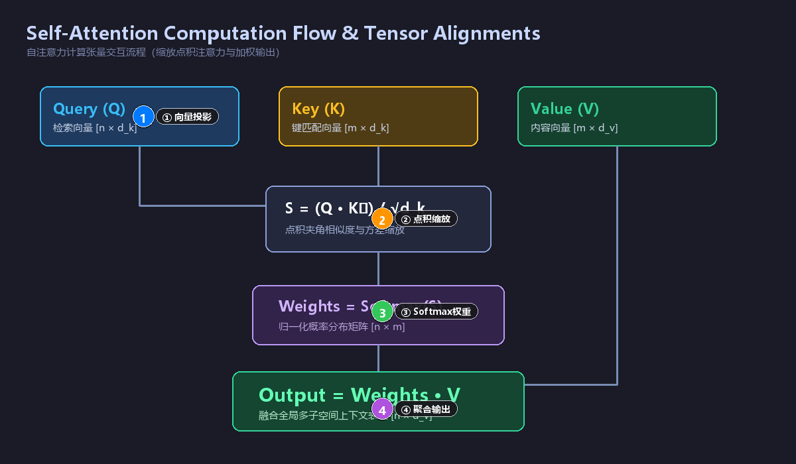
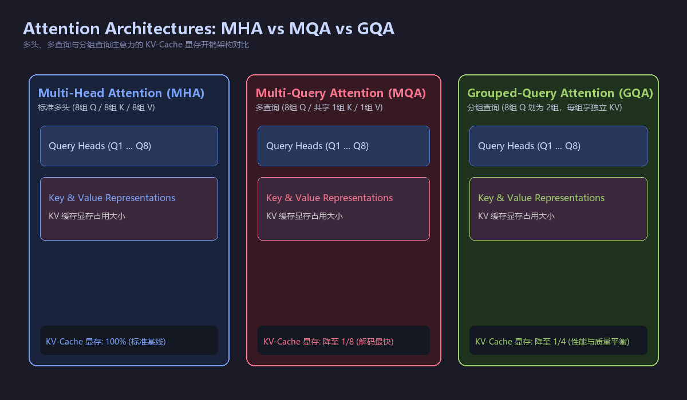

# 大模型注意力机制与计算原理全景图谱

## 1. 序列建模历史演进与瓶颈
### 经典循环神经网络 (RNN, Recurrent Neural Network)
#### 串行递推架构原理
##### 核心机制：隐藏状态 h_t 依赖前一时刻 h_(t-1) 顺序计算
##### 训练性能瓶颈：计算无法跨时间步并行化，无法充分利用 GPU 张量核心
##### 长程依赖丢失：反向传播中连乘导致梯度消失与梯度爆炸，产生严重长程遗忘
### 序列到序列模型引入注意力 (Seq2Seq with Attention)
#### 编码器-解码器架构革新
##### 解决痛点：突破传统编码器将变长序列强行压缩为单一固定维度向量的语义瓶颈
##### 动态对齐分数计算：基于解码器隐状态与全部编码器隐状态动态计算权重分配

## 2. 自注意力机制 (Self-Attention) 核心数学原理
### 核心向量投影与映射
#### 三大投影矩阵定义
##### 查询矩阵 Q (Query，发出检索请求，维度 n × d_k)
##### 键矩阵 K (Key，与查询进行相似度匹配，维度 m × d_k)
##### 值矩阵 V (Value，实际提取的内容信息，维度 m × d_v)
#### 投影参数：Q = X · W^Q, K = X · W^K, V = X · W^V (W 为可学习权重参数)
### 注意力计算全流程四步法
#### 计算流程与视觉全貌
##### 
##### 第一步 点积相似度计算：S = Q · Kᵀ (点积衡量向量夹角余弦相似度)
##### 第二步 尺度缩放变换：S_scaled = (Q · Kᵀ) / √d_k (除以维度平方根维持方差为 1)
##### 第三步 归一化概率分布：Attention_Weights = softmax((Q · Kᵀ) / √d_k)
##### 第四步 加权聚合输出：Output = Attention_Weights · V
#### 缩放因子 √d_k 的数学物理意义
##### 维度膨胀效应：当 d_k 很大时，点积数值方差膨胀至 d_k，导致数值过大
##### 梯度饱和规避：防止 Softmax 进入极平缓的饱和区导致梯度极小无法更新

## 3. 多头注意力机制 (MHA, Multi-Head Attention)
### 多子空间并行表征设计
#### 架构切分逻辑
##### 投影切分：将 d_model 投影为 h 个子空间，每个头维度 d_k = d_model / h
##### 并行计算：每个头独立执行注意力 head_i = Attention(Q·W_i^Q, K·W_i^K, V·W_i^V)
##### 拼接与线性变换：MultiHead = Concat(head₁, head₂, ..., head_h) · Wᴼ
#### 语义认知优势
##### 单头注意力的局限：单组权重容易被全局最显著词主导，丧失微观语义关联
##### 多头协同模式：不同注意力头分别聚焦句法依赖、长程共指、局部短语与篇章逻辑

## 4. 计算复杂度与工程优化前沿
### 标准注意力复杂度瓶颈
#### 资源开销模型
##### 时间复杂度：O(n² · d)，计算开销随上下文长度 n 呈二次方暴增
##### 空间复杂度：O(n²)，存储 N×N 注意力权重矩阵导致显存极易 OOM
### 主流显存与计算优化技术对比
#### 技术方案横向对比
##### 
| 优化方案 | 核心加速机制 | 显存复杂度 | 典型适用场景 |
| :--- | :--- | :--- | :--- |
| **FlashAttention** | 针对 GPU SRAM/HBM 层次存储的分块在线 Softmax | O(n) | 大模型长文本训练与推理标配 |
| **Multi-Query (MQA)** | 共享一组 K 和 V 矩阵，保留多个独立 Q 投影 | 显著降低 KV-Cache | 高并发自回归大模型解码加速 |
| **Grouped-Query (GQA)** | 将 Q 分为若干分组，每组共享一组 K 和 V (Llama 3 标配) | 介于 MHA 与 MQA 之间 | 兼顾生成质量与推理吞吐的最佳平衡 |
| **局部稀疏注意力** | 限制每个 Token 仅与邻近窗口和固定步长 Token 交互 | O(n · k) | 超长文本初筛或专用文档模型 |

## 5. 核心数学公式与符号全集
### 核心计算式
#### 缩放点积注意力公式：Attention(Q, K, V) = softmax(Q·Kᵀ / √d_k) · V
#### 多头注意力拼接公式：MHA(Q, K, V) = Concat(head₁, head₂, ..., head_h) · Wᴼ
#### 旋转位置编码 (RoPE) 相对位置内积：⟨R_θ,m^d · x_m, R_θ,n^d · x_n⟩ = g(x_m, x_n, m - n)
